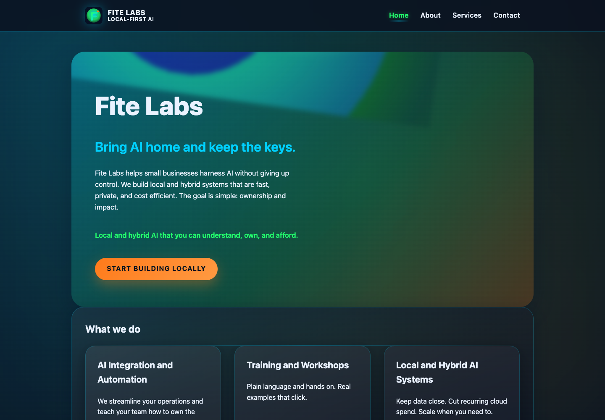

# FITE Labs website

A fast, accessible website for FITE Labs, a local and hybrid AI practice for
small businesses. The site explains the value of owning more of your AI stack
without hiding the message behind technical jargon.

[View the live site](https://gabriel-olinger.github.io/fite-labs-page/) ·
[View the services page](https://gabriel-olinger.github.io/fite-labs-page/services.html)



## Project status

**Live and deployed.** The current version is served through GitHub Pages and
works without a build step or client-side framework.

## What this project demonstrates

- Translating an AI infrastructure concept into clear customer-facing language
- Responsive design with plain HTML, CSS, and JavaScript
- Semantic page structure and keyboard-friendly navigation
- Progressive enhancement: core content remains usable without JavaScript
- Reduced-motion support and visible focus states
- Search and social metadata, canonical URLs, a sitemap, and robots directives
- Lightweight deployment through GitHub Pages

## Pages

| Page | Purpose |
| --- | --- |
| `index.html` | Value proposition, services overview, and primary calls to action |
| `about.html` | Origin, operating principles, and responsible-AI perspective |
| `services.html` | AI integration, training, and local/hybrid system offerings |
| `contact.html` | Contact paths and inquiry guidance |
| `404.html` | Branded fallback for missing pages |

## Run locally

No package installation is required.

```bash
python3 -m http.server 8000
```

Then open [http://localhost:8000](http://localhost:8000).

## Repository structure

```text
.
├── assets/          # Logo and visual assets
├── docs/            # Repository documentation images
├── index.html       # Homepage
├── about.html       # Company story and principles
├── services.html    # Service descriptions
├── contact.html     # Contact experience
├── styles.css       # Responsive design system
└── scripts.js       # Navigation and small interaction enhancements
```

## Design priorities

1. **Clarity:** explain local-first AI in language a small-business owner can
   act on.
2. **Ownership:** emphasize control of data, costs, and infrastructure.
3. **Accessibility:** support keyboard navigation, reduced motion, readable
   contrast, and semantic landmarks.
4. **Low overhead:** keep hosting and maintenance simple by avoiding an
   unnecessary application framework.

## Deployment

GitHub Pages serves the root of the `main` branch at
[gabriel-olinger.github.io/fite-labs-page](https://gabriel-olinger.github.io/fite-labs-page/).

## License

Released under the [MIT License](LICENSE).
